# Workout Diary ("HYPE") 
A web application serving as a workout journal, allowing users to record their completed workouts by inputting exercises, sets, weight and repetitions. 
Additionally, it enables users to view statistics generated based on their workouts and utilize an exercise database. 

## Table of contents
* [Technologies](#technologies)
* [Setup](#setup)
* [Features](#functionalities)
* [App presentation](#apppresentation)

## Technologies
Project is created with:
* JavaScript
* React
* HTML
* CSS
* Node.js
* React bootstrap, React context, React router dom, React spring
* Axios
* MySQL

## Setup
Simply download the zip file and then open the terminal. Navigate to both the frontend and backend folders with `cd backend/frontend`, and execute `npm install` in each. 
After that, start the server by running `nodemon index.js` in the backend folder, and launch the frontend by executing `npm start`.

## Features

**Unregistered user:**
* Ability to use the calorie intake calculator
* Browsing the exercise database
* Registration
* Login
  
**Logged-in user:**
* Access to functionalities of an unregistered user plus:
* Creating a workout,
* Register completed workouts,
* Browse a panel containing the history of all completed workouts,
* Browse a panel containing created workouts,
* Browse a panel containing charts showing user progress,
* Edit workouts,
* Delete workouts,
* Save measurements of selected body parts and browse the history of saved body measurements.
  
**Administrator:**
* Browse the list of users
* Block or unblock a user
* Add exercises to the exercise database
* Browse the exercise database
* Edit exercises
* Delete exercises

## App presentation

### User

The registration form for the application includes data validation.

The Calorie Calculator panel contains a calorie intake calculator, allowing users to calculate their calorie needs based on their training goals. To use the calculator, it's necessary to correctly fill out the form.

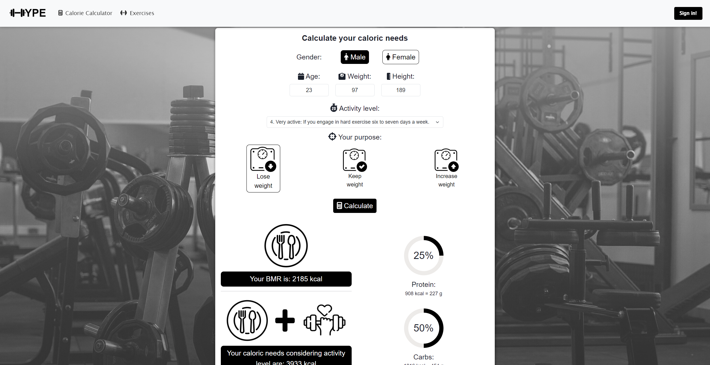

The Exercises panel contains an exercise database, which can be searched by entering their name in the search bar or by selecting the appropriate filter represented by images depicting the target muscle that the user would like to train.

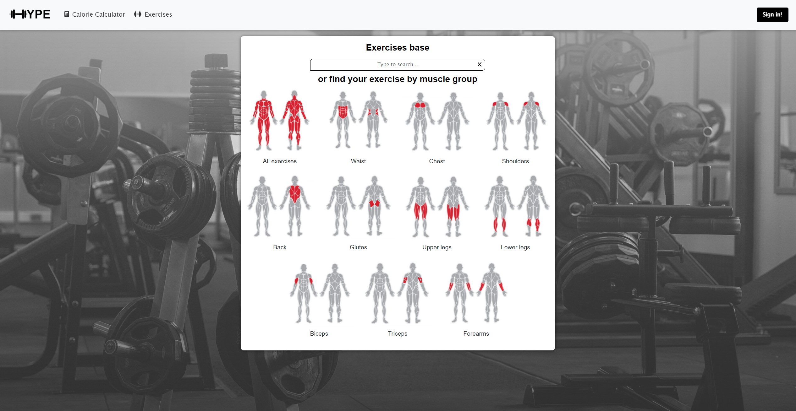

After selecting the "All exercises" filter, all exercises available in the database are displayed, while selecting a specific muscle group shows only exercises targeting that particular muscle group.

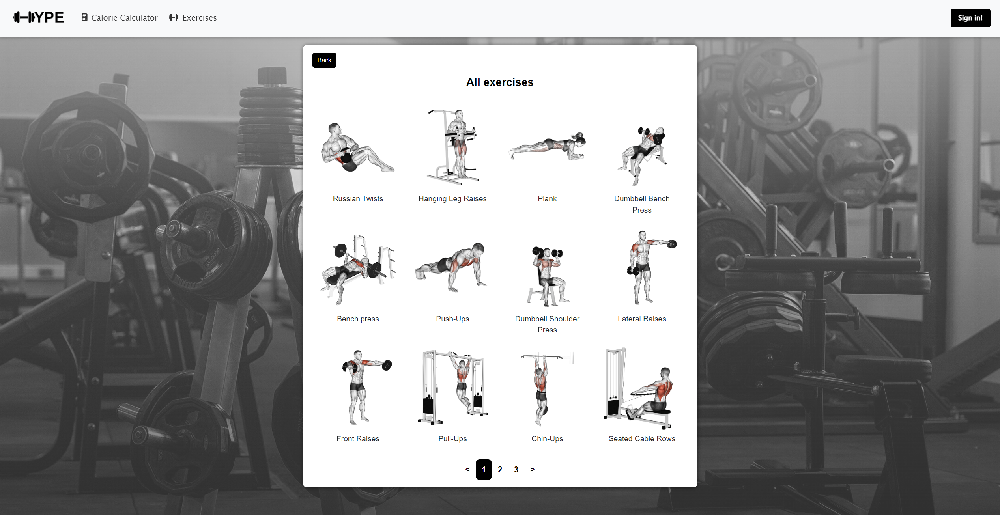

After selecting an exercise, information about it will be displayed, such as the main muscle group and secondary muscle groups trained during its execution, the exercise's difficulty level, equipment needed to perform it, instructions on how to properly perform the exercise, and an instructional video from YouTube.

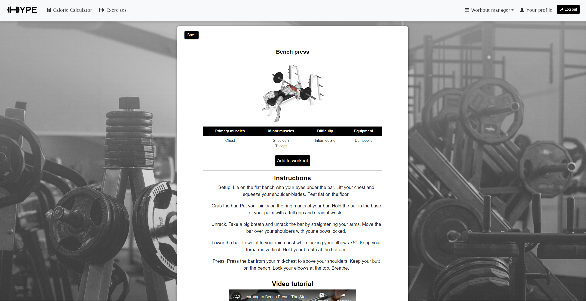

Users can also add an exercise to a selected workout. Upon choosing a workout from the dropdown list containing all workouts created by the user, the exercises already added to it will be displayed.

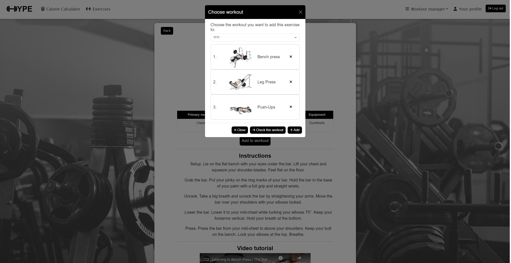

This panel serves as the main dashboard for managing workouts.
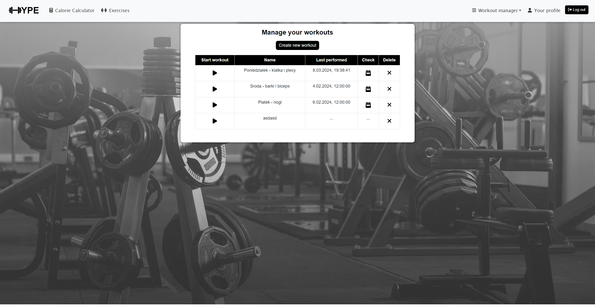

The user can check detailed information about the completed workout by using the button located in the "Check details" column. For each completed exercise, series are displayed along with their parameters:
- Set: series number,
- Reps: number of repetitions,
- Weight: used load,
- Max rep (1RM - One Repetition Maximum): predicted maximum load the user could lift for the given number of repetitions,
- Rest: rest time after completing the series.
  
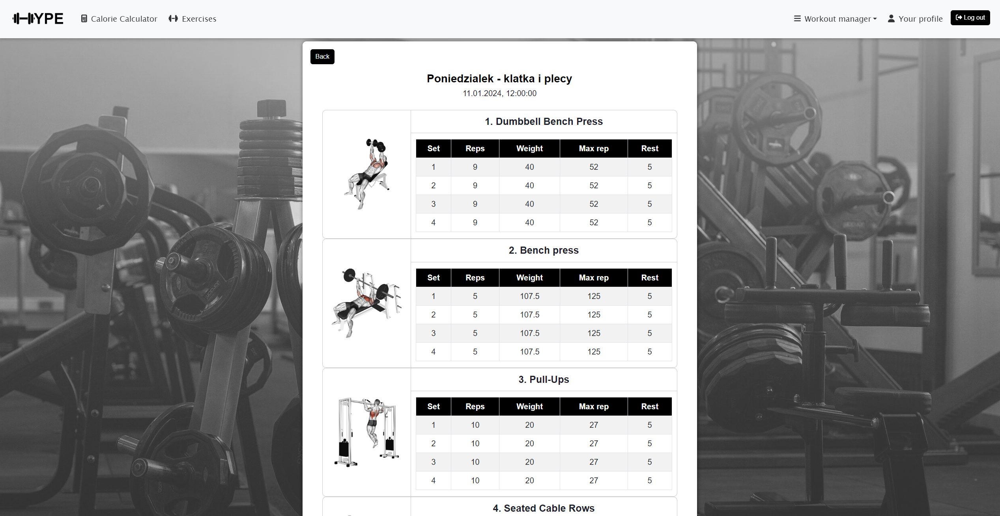

The pages of the form are visible at the bottom of the window, with each page corresponding to one exercise included in the workout. Using the + and - buttons, series for the exercise can be added or removed accordingly. Each added series must be filled out with the weight used, the number of repetitions, and the rest time after completing the series.

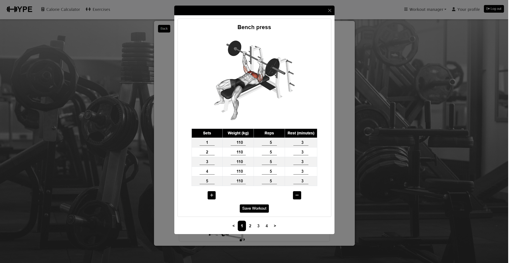

There is a table containing information about completed workouts - their name and date. They can be searched for by their name using the search bar.

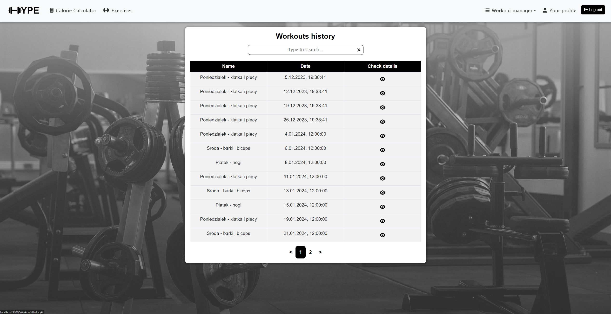

This panel allows users to track their progress in exercises. Upon opening the panel, a dropdown list is visible from which the user can select a specific exercise they have already performed and for which they want to track progress. After selecting the exercise, below the list, a chart is generated based on
data retrieved from the database of all workouts performed by the user.The chart displays values of 1RM (One Repetition Maximum) on the Y-axis, which represents the predicted maximum load the user could lift for the specified number of repetitions in the exercise. The X-axis represents the date when this result was achieved.
This enables users to easily assess their progress by analyzing changes in the maximum load for a given exercise over time.

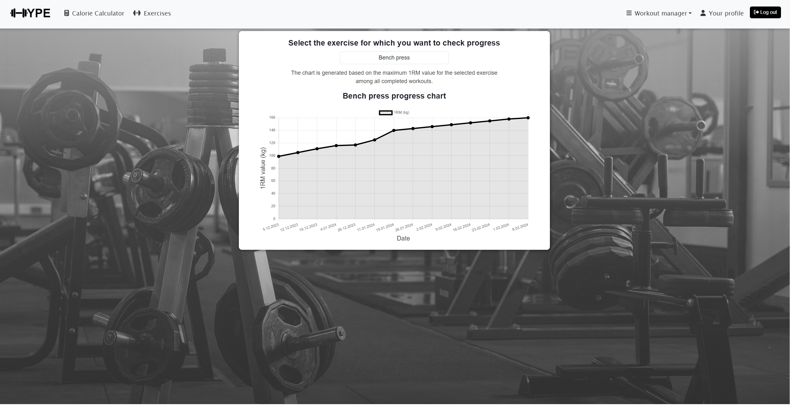

This panel allows users to check their email address and login, as well as to save body measurements. A table displaying the history of measurements is shown on the page.

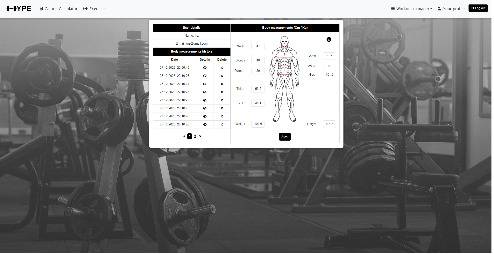

### Administrator

This panel is used to manage registered users. It includes a search bar, which allows for quicker searching by entering the user's login.
Below it, there is a table containing information about registered users, such as login, email, date of last login, and account status. This status indicates whether the user's account is blocked, preventing them from logging in, or unblocked, meaning the account is active.

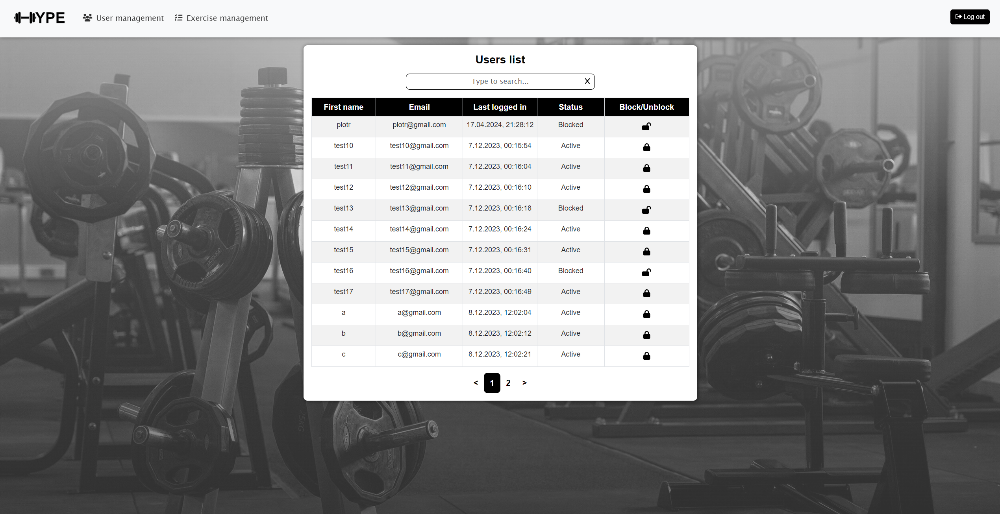

The form for adding a new exercise to the exercise database.

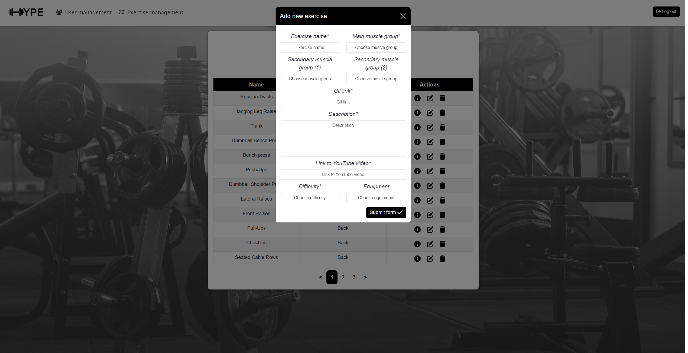

### Responsive examples

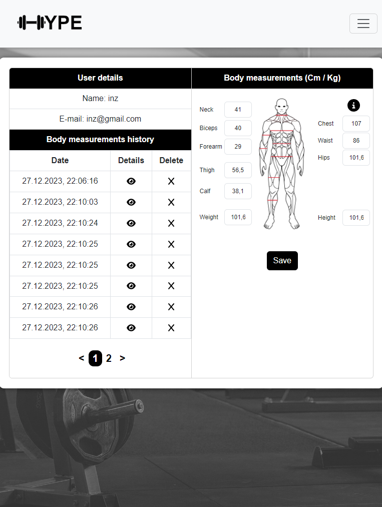

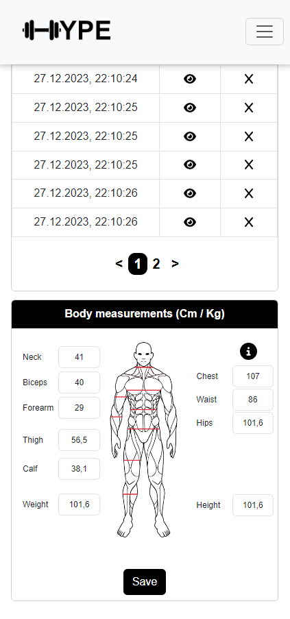

 

